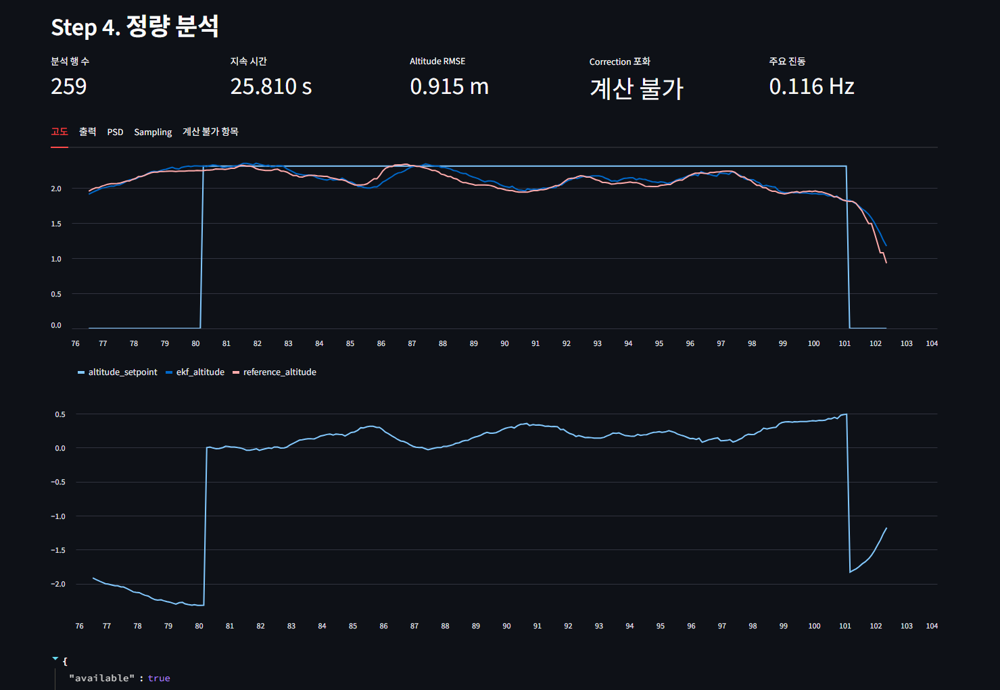
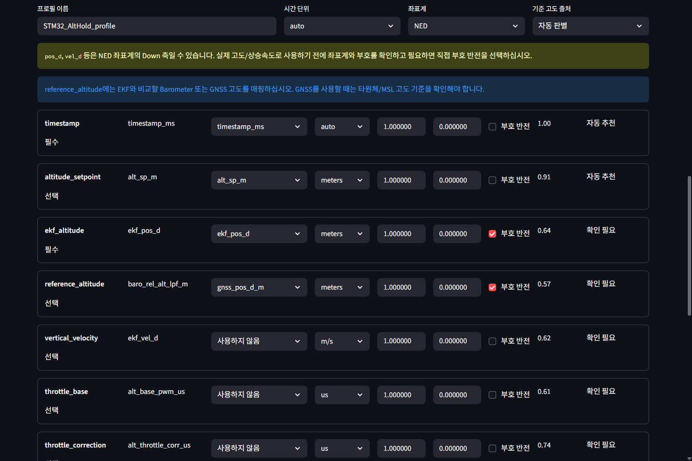
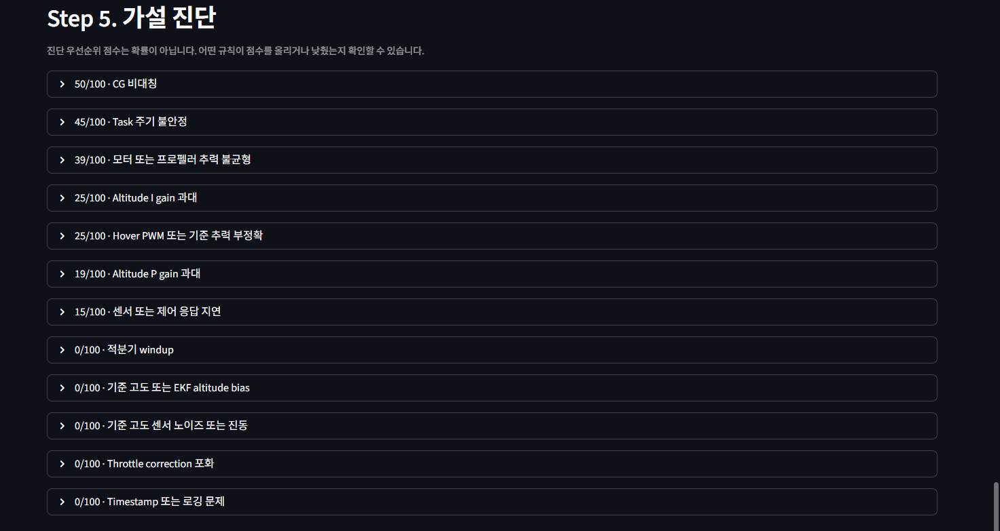

# FlightLog Copilot

> AI-Powered UAV Flight Log Diagnosis

FlightLog Copilot is a working Streamlit application that maps heterogeneous UAV CSV logs to a canonical schema, computes deterministic flight-control metrics in Python, ranks explainable root-cause hypotheses, and optionally asks an AI provider to explain the structured results and recommend validation experiments.

It is not a CSV-to-LLM wrapper: parameter interpretation, unit conversion, signal processing, quantitative evidence, and rule scores are produced locally before any optional AI request.

<p align="center">
  
</p>

한국어 요약: FlightLog Copilot은 STM32 기반 UAV 비행 로그를 사용자가 확인한 표준 파라미터로 변환하고, Python 정량 분석과 설명 가능한 규칙으로 진단 가설의 검토 우선순위를 제시하는 로컬 웹 애플리케이션입니다. AI Provider 연동은 선택 기능이며 원시 CSV를 대신 분석하지 않습니다.

The `KO / EN` selector changes the application UI, diagnostic text, optional AI response language, and downloadable reports without discarding uploaded data, confirmed mappings, or local analysis results.

## Problem and Design Principles

Flight-log column names, units, coordinate frames, and sign conventions vary across firmware and logging configurations. Treating a name such as `pos_d` as altitude without checking its frame and sign can invalidate every downstream metric. FlightLog Copilot addresses that risk with four design principles:

- **Human-confirmed semantics:** automatic mapping proposes candidates, but only mappings explicitly confirmed by the user enter the analysis.
- **Deterministic evidence first:** Python performs validation, transformation, statistics, signal processing, and hypothesis scoring.
- **Explainable diagnosis:** every score exposes supporting rules, counter-evidence, missing inputs, limitations, and suggested tests.
- **Optional and bounded AI:** AI receives a compact structured analysis result, never the complete CSV or credentials, and local analysis remains usable if AI is disabled or fails.

## Architecture and Trust Boundary

```text
CSV upload
  -> column profiling
  -> automatic mapping candidates
  -> user-confirmed mapping and transforms
  -> flight-segment selection
  -> deterministic Python analysis
  -> explainable rule-based hypotheses
  -> optional AI Copilot explanation
  -> Markdown / JSON / HTML reports
```

| Component | Responsibility |
| --- | --- |
| Python analysis engine | Loads and validates data, applies unit/sign transforms, extracts a flight segment, computes statistics and signal-processing metrics, evaluates rules, and creates structured JSON. |
| AI Copilot | Summarizes quantitative results, explains relationships between existing hypotheses, organizes evidence and counter-evidence, describes missing data, and recommends validation experiments. |
| User | Confirms column meaning, units, coordinate frame, axis direction, sign, and the final mapping used by the analysis. |

The external AI provider does **not** receive:

- the complete raw CSV;
- individual log rows;
- API keys or credential-store contents;
- local file paths;
- the user's PC account or other machine information.

The codebase separates the Streamlit UI (`app.py`) from loading, mapping, preprocessing, quantitative analysis, rule evaluation, reporting, and provider-specific clients under `src/flightlog_copilot/`.

## Core Features

### 1. Explainable Parameter Mapping

The mapper uses normalized column names, an alias dictionary, token similarity, data type, value range, and related-column context to propose canonical flight parameters with confidence and evidence. The user can override the source column, choose a unit, apply scale and offset, and reverse the sign.

NED/ENU, FRD/FLU, and upward/downward-positive conventions are never inferred as facts. Down-axis candidates such as `pos_d` and `vel_d` remain subject to user review. This is a correctness boundary, not only a UI convenience: an incorrect frame, unit, or sign would distort the entire analysis.

Confirmed mappings can be exported as JSON and reused. A profile stores the header hash, time unit, coordinate frame, reference-altitude source, column selection, unit, scale, offset, and sign. Older `barometer_altitude` profiles are migrated to `reference_altitude` with a barometer source when loaded.

<p align="center">
  
</p>

### 2. Deterministic Quantitative Analysis

After mapping confirmation and flight-segment selection, the local Python engine computes:

- altitude RMSE, MAE, error distribution, steady-state error, and conservative step-response metrics;
- sampling interval, estimated frequency, jitter, duplicate/reversed timestamps, and dropout candidates;
- throttle-correction and motor-output saturation, duration, spread, and variability;
- reference-altitude versus EKF bias, dispersion, Pearson correlation, and cross-correlation lag;
- detrended, windowed Welch PSD and dominant vibration frequencies.

Missing optional parameters disable only the affected calculation and are reported as unavailable; they do not stop the full workflow. All baseline analysis, rule evaluation, charts, and reports work without an AI call.

### 3. Evidence-Based Hypothesis Diagnosis

The rule engine evaluates 12 possible causes and orders them by a transparent **diagnostic review priority score**. This score is not a probability and does not establish the actual fault. Each hypothesis includes evidence, counter-evidence, missing parameters, known limitations, the rules that raised or lowered its score, and a recommended follow-up experiment.

AI-proposed ideas are displayed separately as unverified hypotheses so they cannot be confused with rule-supported results.

<p align="center">
  
</p>

### 4. Optional AI Copilot

The application supports the official OpenAI API and OpenAI Chat Completions-compatible servers such as Ollama, vLLM, LiteLLM, LM Studio, llama.cpp server, and internal gateways. Provider-specific settings remain independent, and an AI failure never removes the deterministic analysis result.

## Installation and Quick Start

Python 3.9 or later is recommended.

```powershell
python -m venv .venv
.\.venv\Scripts\Activate.ps1
python -m pip install -r requirements.txt
streamlit run app.py
```

To explore the workflow, upload `sample_data/sample_alt_hold.csv`, review the proposed mapping, confirm the time and altitude units, choose an AltHold segment, and run the quantitative analysis.

## AI Provider and API-Key Configuration

Open **AI settings** in the sidebar and follow this flow:

1. Enable `AI Copilot`.
2. Select `OpenAI` or `OpenAI Compatible`.
3. Register an API key, or choose the Compatible no-key mode.
4. Select a discovered model or enter the actual model ID manually.
5. Optionally load the model list from the provider.
6. Run the short `AI connection test`.
7. Save the non-secret settings.
8. Run `AI diagnosis` after the local quantitative analysis completes.

| Provider | API path | Configuration |
| --- | --- | --- |
| OpenAI | Official SDK Responses API with Pydantic structured output | API key, discovered/suggested/manual model ID, temperature, maximum output tokens |
| OpenAI Compatible | `{base_url}/v1/chat/completions` | Base URL, API key/no-key/custom Bearer mode, discovered/manual model ID, temperature, maximum output tokens |

Compatible URLs ending with no slash, `/`, `/v1`, or `/v1/` are normalized to one `/v1` suffix. Failure of the optional `/v1/models` endpoint is non-fatal because manual model entry remains available. Bundled OpenAI model suggestions are conveniences, not guarantees that a model is enabled for a particular account; use model discovery and the connection test to verify availability.

<details>
<summary>API-key storage, fallback, and deletion</summary>

Keys registered in the UI are stored through Python `keyring`; Windows uses Credential Manager when a supported backend is available. OpenAI Compatible credentials are separated by a hash of the normalized Base URL.

Resolution order:

1. a key newly registered in the current Streamlit session;
2. the OS keyring;
3. `OPENAI_API_KEY` or `OPENAI_COMPATIBLE_API_KEY`;
4. no key.

The password field is never repopulated. The UI shows only the final four characters of a stored key. If keyring access fails, the key is kept only in the current session and is never written to a plaintext fallback file. Deleting a key requires an explicit confirmation checkbox; environment variables are not modified by the application.

`ai_settings.json` contains only non-secret provider settings and is written atomically in the platform-specific user configuration directory. It never contains a complete key, masked key, or environment-variable value. Corrupt settings are backed up before defaults are loaded.

Environment variables remain an optional fallback:

```powershell
Copy-Item .env.example .env
```

```dotenv
OPENAI_API_KEY=
OPENAI_COMPATIBLE_API_KEY=
```

Never commit a real key.

</details>

## Input Parameters and Mapping Profiles

Minimum canonical parameters:

- `timestamp`
- `ekf_altitude`

Optional groups:

- altitude tracking: `altitude_setpoint`, `throttle_correction`, `althold_active`;
- reference comparison: `reference_altitude` from barometer, GNSS, or another documented source;
- actuator output: `throttle_base`, `motor_1` through `motor_4`;
- segment detection: `armed`, `althold_active`;
- supporting motion data: `vertical_velocity`.

The configured transform is:

```text
converted_value = sign × raw_value × scale + offset
```

Time is then normalized to seconds and altitude to meters. A GNSS reference requires explicit attention to ellipsoid versus MSL datum; an automatically inferred source remains reviewable in the mapping profile.

## Metrics and Reports

The application renders metric cards, time-domain charts, PSD results, data-quality messages, and expandable hypothesis details. It exports:

- a Markdown diagnostic report;
- structured JSON analysis;
- the confirmed mapping profile as JSON;
- a standalone HTML report.

Correlation and cross-correlation lag are presented with an explicit warning that they do not establish causality.

## Testing

```powershell
python -m pytest
```

The pytest suite covers CSV parsing, aliases and canonical mapping, transforms and time units, timestamp quality, altitude/actuator/sensor/frequency metrics, rule scoring, reference-altitude behavior, bilingual output, provider-specific settings, URL normalization, atomic settings persistence, keyring fallback and deletion, client construction, error classification, structured AI responses, and raw-data rejection. External AI APIs are mocked.

The included sample log is synthetic: it provides known timing and frequency characteristics for checking the signal-processing implementation. Passing synthetic tests does **not** demonstrate real-world fault-diagnosis performance.

## Project Status and Validation Status

- **Current:** feature-rich engineering MVP
- **Next milestone:** validated real-flight case study
- **Long-term goal:** reusable evidence-based diagnosis workflow across airframes

The data pipeline, explainable mapping, deterministic metrics, rule evaluation, optional AI-provider integration, and report generation are implemented. However, diagnostic thresholds and root-cause rules have not yet been calibrated against a sufficiently large collection of real flights with independently verified fault labels.

Current hypothesis scores must therefore be interpreted as transparent engineering priorities for further investigation, not as validated fault probabilities. The system evaluates possible causes, identifies supporting and opposing evidence, and recommends validation experiments; it does not claim to automatically determine the true root cause.

Validation currently establishes that the software behaves consistently on unit tests and controlled synthetic signals. It does not yet establish sensitivity, specificity, or generalization across airframes. Thresholds require calibration for each vehicle, logging configuration, and operating envelope.

## Current Limitations

- Firmware aliases cover common names; unfamiliar formats require manual mapping.
- Attitude, battery, current, vibration, and integrator-state omissions can prevent separation of CG, thrust, voltage, and windup hypotheses.
- Automatic timestamp-unit inference is ambiguous at boundary sampling rates.
- Step-response metrics use conservative definitions and are not yet robust to every step direction, missed target, or multi-step sequence.
- Cross-correlation lag can be distorted by unequal sampling, repeated signals, and low-frequency trends; it is not causal evidence.
- GNSS and EKF altitude may differ because of origin and ellipsoid/MSL datum choices.
- Rule thresholds are engineering defaults and need per-airframe calibration against real, independently reviewed cases.
- Segment selection uses Streamlit controls rather than free-form chart brushing.
- Compatible servers vary in support for model listing, JSON output, temperature, and token-limit parameters.
- The current HTML export wraps Markdown text in a styled `<pre>` block rather than rendering a full report layout with charts.
- The Streamlit UI remains concentrated in a large `app.py`, and automated GitHub Actions are not configured yet.

## Next Engineering Milestones

### Priority 1. Timestamp Unit Inference

The current interval-only heuristic can interpret a 1 Hz seconds log such as `0, 1, 2, 3, 4` as milliseconds. The next implementation should combine timestamp suffixes, absolute value scale, and sample interval; expose the inferred unit and confidence in the UI; and request user confirmation when confidence is low. Boundary tests must include 1 Hz and other low-frequency second-based logs.

### Priority 2. Step-Response Metric Refinement

- Separate rising and falling steps.
- Prevent initial rising error from being counted as undershoot.
- Define explicit pre-step and post-step steady-state windows.
- Select the target transition explicitly when several setpoint changes exist.
- Define behavior when the response never reaches the target.
- Add synthetic rising, falling, missed-target, and multi-step response tests.

### Priority 3. Cross-Correlation Reliability

- Resample both signals onto the same time axis before comparison.
- Detrend inputs and limit the maximum lag search window.
- Require a minimum peak-correlation confidence.
- Document the lag-sign convention.
- Warn when periodic signals or low-frequency trends can create a false lag.
- Validate against synthetic signals with known delay.

### Priority 4. Boundary-Condition Test Expansion

Add explicit coverage for 1 Hz seconds, milliseconds, microseconds, irregular sampling, duplicate and reversed timestamps, rising and falling steps, missed targets, multiple setpoint steps, constant signals, weak and multi-frequency vibration, known sensor delay, one CSV column mapped to multiple canonical parameters, partial motor columns, missing values, and short logs.

### Priority 5. Dynamic OpenAI Model Discovery

After key registration, query the official SDK or `/v1/models` and use models returned for the current account as the primary selection source. Preserve manual model entry when discovery fails, and avoid treating any bundled model ID as universally available so an outdated or unavailable default does not cause a first-run 404.

### Priority 6. Real AltHold Case Study

The next validation milestone is an end-to-end real-flight case study:

```text
real AltHold log
  -> quantitative evidence
  -> ranked rule-based hypotheses
  -> comparison with an engineer's prior analysis
  -> validation experiment
  -> parameter or mechanical change
  -> before/after RMSE, saturation, and vibration comparison
```

The study should publish flight conditions, logged parameters, mapping and coordinate frame, observed behavior, quantitative evidence, top hypotheses, experiments performed, before/after results, and cases where the analysis was wrong or uncertain. Until this exists, FlightLog Copilot should not be described as a validated automatic fault-diagnosis system.

### Priority 7. UI Modularization and Report Improvement

Split the large Streamlit entry point by workflow responsibility:

```text
src/flightlog_copilot/ui/
├── ai_settings.py
├── upload.py
├── mapping.py
├── segmentation.py
├── metrics.py
├── diagnosis.py
└── reports.py
```

Replace the current `<pre>`-based HTML export with styled sections, metric cards, tables, per-hypothesis evidence and limitations, key charts, and a print/PDF-friendly layout.

### Priority 8. Continuous Integration

Add GitHub Actions for dependency installation, pytest, a basic import check, and optional lint/format checks on pull requests and pushes to `main`. Add a CI badge only after the workflow exists and passes successfully.
